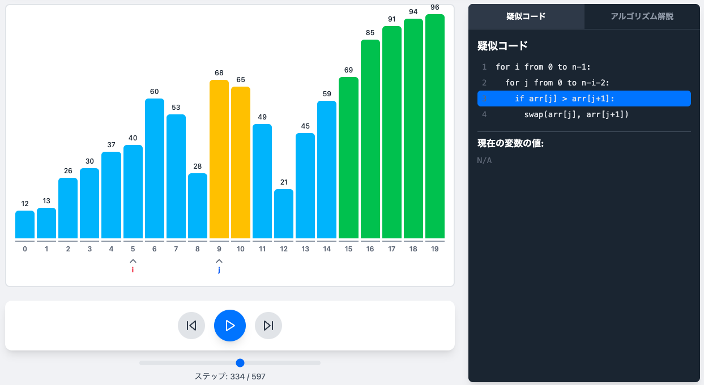

# ソートアルゴリズム可視化ツール (Sort Algorithm Visualizer)

主要なソートアルゴリズムの動作を視覚的に解説する、Webベースのインタラクティブな学習ツールです。

[**デモページ (Live Demonstration)**](https://agtkh.github.io/sort-visualizer/)

---

## 主な機能 (Features)

*   **アルゴリズムの可視化 (Algorithm Visualization)**
    バブルソート、選択ソート、挿入ソート、シェルソート、クイックソート、マージソートなど、基本的なソートアルゴリズムの動作をアニメーションで表示します。

*   **インタラクティブな操作 (Interactive Controls)**
    再生、一時停止、ステップ実行、逆再生、速度調整といった豊富な制御機能により、学習者は自身のペースでアルゴリズムの挙動を詳細に追跡できます。

*   **データセットのカスタマイズ (Customizable Datasets)**
    データ数や配列の値を自由に変更し、様々な条件下でのアルゴリズムの性能を検証できます。ランダムなデータセットの生成も可能です。

*   **疑似コードとの連携 (Pseudocode Synchronization)**
    アニメーションの進行に合わせ、実行中の疑似コードの該当行をハイライトします。同時に、その時点での変数の状態も表示され、ロジックの理解を補助します。

*   **理論的解説 (Theoretical Explanations)**
    各アルゴリズムの計算量（時間・空間）、安定性などの理論的背景や特性について、詳細な解説を提供します。

*   **レスポンシブデザイン (Responsive Design)**
    デスクトップからモバイルデバイスまで、様々な画面サイズに最適化されたUIを提供します。

## 使用技術 (Technology Stack)

*   **フレームワーク**: [React](https://react.dev/)
*   **ビルドツール**: [Vite](https://vitejs.dev/)
*   **スタイリング**: [Tailwind CSS](https://tailwindcss.com/)
*   **リンター**: [ESLint](https://eslint.org/)
*   **アイコン**: [Lucide React](https://lucide.dev/)
*   **開発支援**: Google Gemini

## ©️ ライセンス (License)

このプロジェクトは [MIT License](LICENSE) の下で公開されています。

---

*   **開発者 (Developer):** K. Agata
*   **開発支援 (Development Assistance):** Google Gemini
*   **Copyright &copy; 2025 K. Agata. All Rights Reserved.**